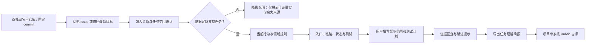
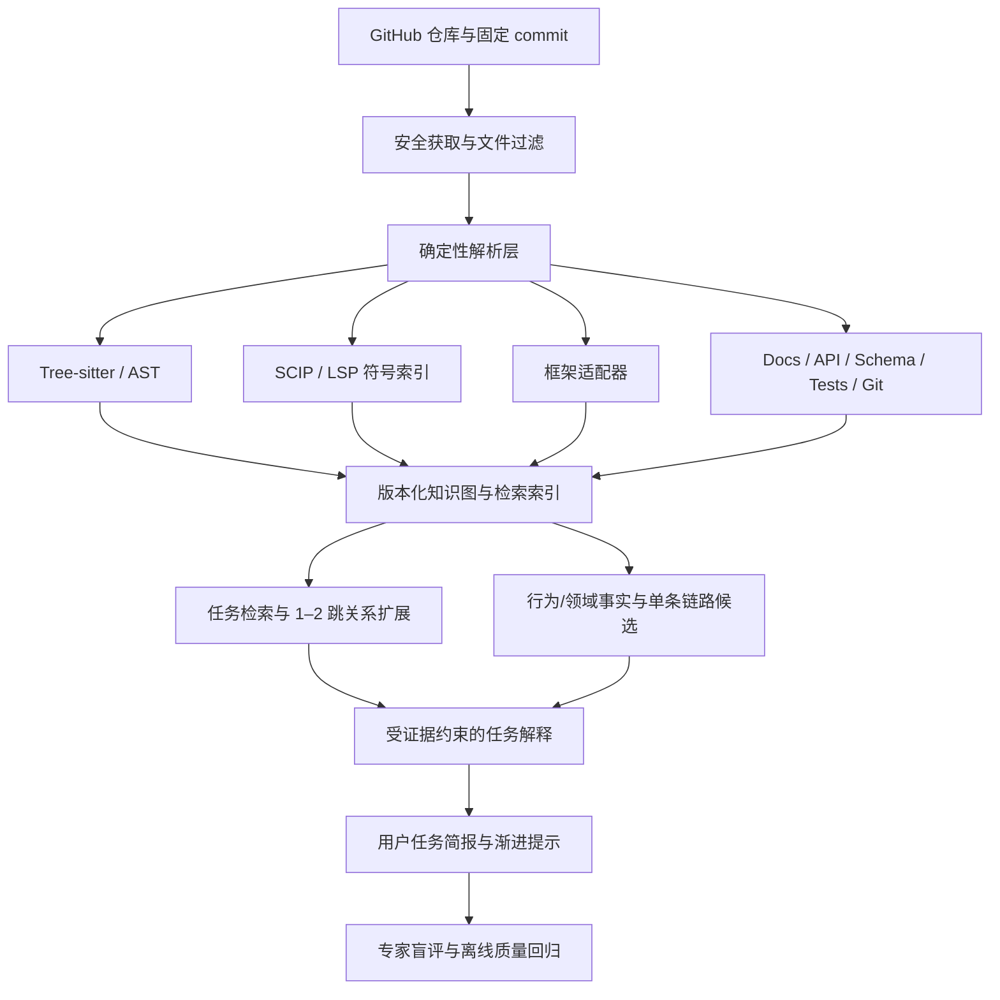

# Repo Atlas 产品需求文档（PRD）

> 状态：调研与验证版 / 待用户访谈验证  
> 版本：v0.2  
> 日期：2026-08-14  
> 工作名称：Repo Atlas  
> 文档负责人：产品  
> 目标读者：创始团队、产品、设计、研发、AI/数据、安全与开源贡献者

---

## 0. 决策摘要

### 0.1 产品结论

Repo Atlas 不应成为“另一个 AI Wiki”或“另一个代码聊天框”，而应成为一个**任务驱动、可验证的开源项目学习教练**：用户输入仓库和一个明确的 Issue/改动目标后，系统引导其理解当前行为与领域规则、追踪技术链路，并亲自形成影响范围和测试计划，帮助开发者从“读过代码”走到“能解释、能定位、能规划安全修改”。

核心学习闭环：

```text
输入真实改动任务 → 理解行为与领域规则 → 追踪技术链路
→ 用户形成影响/测试计划 → 独立验证 → 给出下一步行动
```

产品的核心差异化不是“生成了多少页文档”，而是以下三点：

1. **业务到代码的映射**：把角色、场景、能力和规则映射到 API、事件、模块、数据和测试。
2. **真实任务驱动的主动学习**：围绕用户带来的改动目标组织内容，而不是给所有人生成同一套 Wiki。
3. **可验证的任务准备度**：逐条证据、版本快照、未知项与用户亲自完成的修改计划共同降低“AI 说得清楚，所以我误以为自己懂了”的风险。

### 0.2 建议的首发切口

首个验证版本只服务一个 JTBD：

> **有经验的开发者面对陌生开源仓库中的一个明确改动目标时，在 45 分钟内形成一份有证据、方向正确的行为理解、代码定位、影响范围和测试计划。**

- **首要用户**：有 2–8 年经验、带着明确 Issue 或自然语言改动目标进入的二开者/早期开源贡献者。
- **首要结果**：由用户本人完成“任务理解简报”，而不是由 AI 代写最终答案；项目熟悉者可据统一 Rubric 盲评其是否已具备开始修改的准备度。
- **Alpha 仓库**：预先审核并索引的 TypeScript/Node.js HTTP 服务仓库；首个解析切片暂定 Express，固定 commit、≤100k 有效 LOC。该技术切片是待 Phase 0 访谈校验的工作假设。
- **Alpha P0 交付物**：仓库准入诊断、任务范围确认、任务相关的行为/领域简报、单条技术链路、逐条证据、用户填写的影响与测试计划、Markdown 导出。
- **Self-serve Beta 扩展**：任意受支持的公开 GitHub URL、更多 Node 框架，再依据质量数据扩展 Python。
- **首个 Alpha 明确不做**：完整项目 Wiki/双地图、自由问答、AI 自动“掌握”评分、快照自动更新、代码补全、自动提交 PR、私有仓库和跨仓全景。

### 0.3 产品原则

1. **AI-first，但不是 AI-only**：AI 负责归纳、解释、命名和教学；解析器、符号索引、Git 元数据、测试与运行时数据负责提供事实。
2. **证据先于流畅**：宁可明确说“仓库中未找到”，也不生成没有依据的完整故事。
3. **业务是证据支持的假设**：代码往往无法表达完整的市场与产品意图；代码推导出的业务结论必须标记为“推断”。
4. **真实任务先于内容目录**：首版只展示与当前 Issue/改动目标有关的行为、领域和技术上下文。
5. **从理解走向行动，但不替代用户思考**：AI 提供证据、脚手架和渐进提示；最终影响与测试计划必须由用户完成，首版不直接写代码。
6. **版本可追溯**：代码证据绑定不可变 commit；Issue/PR/Release 等外部来源绑定 node ID、抓取时间、内容哈希和不可变快照。

### 0.4 当前假设与边界

本 PRD 基于公开资料、竞品桌面研究和产品/技术可行性分析，**尚未完成真实用户访谈与可用性实验**。文中的用户频率、转化目标、TypeScript/Express 技术切片和功能优先级均是待验证假设，不应被视为已验证市场事实。若 Phase 0 证明另一个人群/任务显著更强，应先修订 PRD，再扩展范围。

本文假设“开源项目学习产品”同时表示：

- 产品服务于开源仓库学习；
- Repo Atlas 自身也计划开源。

若后者并非项目目标，需要重新评估部署、模型密钥、许可证和商业化章节。

---

## 1. 背景与问题定义

### 1.1 背景

开发者理解陌生仓库时，通常需要在 README、目录树、源码、测试、Issue、PR、Release、外部文档和 AI 对话之间反复切换。信息并非完全缺失，而是缺少一条把“项目为什么存在”连接到“代码如何实现”的可靠路径。

历史研究表明，开发者会投入大量精力建立代码心智模型；微软的一项开发者研究中，66% 的受访者将“理解一段代码背后的理由”视为严重问题，61% 认为难以感知其他代码变化对自己的影响。该研究年代较早，不能直接证明今天的市场规模，但说明“为什么”和“影响面”长期是代码理解的核心问题。[Microsoft Research：Software Development at Microsoft Observed](https://www.microsoft.com/en-us/research/publication/software-development-at-microsoft-observed/)

开源新人还面临“从哪里开始”的问题。相关系统性研究把障碍归纳为社交互动、既有知识、寻找起点、文档和技术障碍；一项针对潜在开源新人的研究中，“找到开始方式”是最突出的障碍。[OSS 新人障碍系统综述](https://www.sciencedirect.com/science/article/pii/S0950584914002390)、[Newcomer OSS-Candidates](https://link.springer.com/article/10.1007/s10664-022-10163-0)

AI 提高了生成答案的速度，但没有自动解决可信度。Stack Overflow 2025 开发者调查显示，46% 的开发者倾向不信任 AI 输出准确性，只有 33% 倾向信任。这意味着面向专业开发者的学习产品必须提供证据、拒答和校验机制。[Stack Overflow 2025 Developer Survey](https://survey.stackoverflow.co/2025/ai)

### 1.2 核心问题

目标用户当前面临五个连续问题：

1. 不知道应该先看什么，也不知道该问什么。
2. 能看懂局部代码，但不知道项目面向谁、解决什么问题、核心规则是什么。
3. 能看到目录和模块，但无法形成端到端运行链路与影响面。
4. AI 答案缺少逐条依据，用户难以判断事实、综合结论和推断。
5. 阅读结束后没有验证环节，无法确认自己是否已具备定位和修改能力。

### 1.3 机会陈述

如果 Repo Atlas 能让有经验的开发者围绕一个真实改动目标，基于可点击证据正确解释当前系统行为、领域规则、技术链路和影响范围，并让项目专家认可其测试计划，那么它将补上 README/文档、AI Wiki、代码搜索和编码 Agent 之间的“任务驱动验证式学习”空白。

### 1.4 目标

验证版（V0）目标：

- 用户输入一个明确 Issue/改动目标，系统在固定快照上确认任务范围与可分析性。
- 从提交仓库和任务开始计时，用户在 **45 分钟内**完成一份任务理解简报。
- 简报至少正确覆盖：当前/目标行为、相关领域规则、执行入口与关键链路、潜在影响模块、应新增/修改的测试。
- 关键 AI 结论具备原子级证据、证据类型、未知项和不可变来源标识。
- 项目专家盲评任务简报；验证产品是否提高正确率且不增加严重误导，而非由系统自我证明“掌握”。
- 验证用户是否愿意亲自完成理解与计划，而不仅是消费 AI 自动摘要。

### 1.5 非目标

验证版（V0）不负责：

- 自动编写功能、修复缺陷、创建分支或提交 PR；
- IDE 代码补全、重构和通用 Agent 编排；
- 面向零基础用户教授通用编程知识；
- 为没有具体任务的用户生成完整课程、完整项目 Wiki 或全局双地图；
- 自由聊天式仓库问答和 AI 自动掌握评分；
- 快速选型结论；V0 最多给出待验证的技术适配清单，不替代构建、性能、安全、社区健康和许可证评估；
- 对 Python、其他 Node 框架、其他语言和超大型 monorepo 提供深度支持；
- 保证仅靠静态代码还原真实、完整的产品战略或商业流程；
- 企业权限、多租户私有仓库和本地化合规部署；
- 社区、排行榜、课程市场和证书体系；
- 自动生成并长期维护所有项目文档。

---

## 2. 用户研究

### 2.1 目标用户分层

| 用户层 | 特征 | 触发事件 | 主要目标 | V0 优先级 |
|---|---|---|---|---:|
| 任务型二开开发者 | 2–8 年经验，已有明确改动目标但不熟仓库 | 接入、定制、排障或收到需求 | 正确理解当前行为并形成影响/测试计划 | P0 |
| 早期开源贡献者 | 有编程基础，已选定具体 Issue | Good First Issue、Bug 或小功能 | 理解 Issue、定位链路并准备维护者可评审的计划 | P0 |
| 项目熟悉者/维护者 | 熟悉目标功能，可提供真值 | 参与产品评测或审核学习材料 | 盲评任务简报、纠正证据与链路 | P0 验证伙伴 |
| 系统学习者 | 没有具体改动目标，希望学习完整项目 | 学习架构或同类实现 | 建立全项目业务与技术模型 | P1 |
| 技术选型者 | 需要判断项目是否适配 | 技术选型或采购 | 综合功能、性能、安全、社区与许可证 | P2；V0 不承诺选型结论 |
| 企业新成员 | 加入私有代码库 | 入职、换组、接手系统 | 快速形成团队上下文 | P2 |

首版不把零基础编程学习者作为目标用户。其主要问题是通用基础知识和教学体系，而非仓库级理解，会显著扩大内容与评测范围。

### 2.2 核心 Persona

**Persona A：陈工，4 年后端经验，任务型二开者**

- 已决定二开一个工作流服务，需要为“失败节点增加人工重试”形成修改计划。
- 能读懂单个函数，但不知道调度、状态、重试和持久化如何串联。
- 已尝试 README、全局搜索和 AI 聊天，但引用不稳定，答案经常停留在目录解释。
- 成功标准：45 分钟内正确说明当前行为、重试规则、执行入口、状态影响和应补的测试。

**Persona B：林同学，2 年全栈经验，早期开源贡献者**

- 找到一个 Good First Issue，但不知道 Issue 背后的业务意义和项目约定。
- 担心修改面过大或漏掉测试，不敢开始。
- 成功标准：形成一份维护者看得懂、方向正确的修改与测试计划。

**Persona C：王老师，项目维护者，V0 评测伙伴与后续用户**

- README 能完成安装说明，但无法覆盖所有设计理由和常见学习路径。
- 每个新人都重复问“入口在哪里、为什么这样分层、这个规则在哪里实现”。
- V0 成功标准：能用统一 Rubric 判断用户任务简报是否足以安全开始修改，并指出关键遗漏。

### 2.3 核心 JTBD

> 当我需要在陌生开源仓库中完成一个明确改动时，帮助我基于当前行为和领域规则追踪到入口、状态、影响模块与测试，并由我亲自形成可验证的修改计划，以便在写代码前发现理解缺口。

V0 只覆盖两种触发、同一个结果：

- **二次开发**：用户输入自然语言改动目标，完成行为、代码定位、影响范围和测试计划。
- **开源贡献**：用户粘贴同仓库 Issue，完成同样的任务理解简报；贡献规范仅作为证据来源，不扩展为 PR 自动化。

系统学习、评估采用、恢复上下文和团队讲解保留为后续场景，不用于 V0 成功判定。

### 2.4 待验证假设

| 编号 | 假设 | 验证信号 | 否定或调整条件 |
|---|---|---|---|
| H1 | 带明确改动目标的用户仍缺少可靠探索路径 | ≥60% 受访者无法在现有工具中快速找到当前行为、入口、影响和测试 | 用户已有稳定流程，只需更快的搜索 |
| H2 | 行为/领域规则到代码的映射能提高修改计划质量 | 专家盲评正确率显著高于 README + 搜索基线 | 业务/领域层没有带来可测增益 |
| H3 | 任务脚手架优于空白聊天框 | 引导组计划正确率提高且时间不劣化，或时间下降且正确率不劣化 | 两组无显著差异 |
| H4 | 逐条证据是专业用户采用的必要条件 | ≥70% 测试用户在关键结论处主动查看证据 | 引用很少使用，且不改善信任与正确率 |
| H5 | 用户愿意亲自完成计划而不是让 AI 代写 | ≥40% 激活用户提交完整任务简报；多数认为过程有价值 | 用户只消费答案或要求直接生成代码 |
| H6 | TypeScript/Express 服务是足够集中的首个技术切片 | 样本中有足量高频任务，且入口/测试可稳定标注 | 真实需求集中在其他语言/仓库类型 |
| H7 | 固定 commit 能降低认知漂移 | 用户能感知当前快照，并愿意在更新后复核变化 | 用户不关心版本且重建成本过高 |

### 2.5 首轮用户研究计划

招募 18 人：

- 6 名近三个月带明确需求二开过开源项目的开发者；
- 6 名正在准备或近期完成过具体开源 Issue 的贡献者；
- 6 名能为样本仓库提供任务真值的维护者/项目熟悉者。

每人进行 45 分钟情境访谈和 20 分钟任务观察，要求其携带最近真实学习过的仓库。重点观察其标签页、搜索词、笔记、AI 对话、验证方式和卡点，不只询问主观偏好。

关键问题：

1. 最近一次必须理解陌生仓库是什么时候？最终要完成什么？
2. 第一小时依次打开了哪些文件、页面和工具？
3. 哪一刻最不知道下一步做什么？
4. 哪些知识只能从 Issue、PR、提交历史或维护者处获得？
5. 如何判断自己“已经理解”，而不只是“看懂了介绍”？
6. AI 给过什么看似合理但实际错误的答案？如何发现？
7. 修改一个能力时，如何找入口、链路、测试和影响面？
8. 对公开/私有仓库授权、模型数据使用和缓存有哪些顾虑？

问题验证通过门槛：12 名目标开发者中至少 8 人在最近一个月遇到过该任务，至少 6 人每月至少两次需要理解陌生仓库；至少 4 名专家愿意为真实任务提供真值或盲评。若 TypeScript/Express 切片不匹配真实需求，先更换切片并修订 PRD，不并行扩展多个技术栈。

---

## 3. 市场与竞品调研

### 3.1 竞品格局

截至 2026-08-14，市场已经较好覆盖自动 Wiki、仓库问答、代码图谱、IDE Agent 和架构图生成。因此“给仓库生成摘要/图 + 聊天”不足以形成独立价值。

| 产品/替代方式 | 类型与核心能力 | 强项 | 与 Repo Atlas 的空白 |
|---|---|---|---|
| [Google Code Wiki](https://developers.googleblog.com/introducing-code-wiki-accelerating-your-code-understanding/) | 持续生成结构化 Wiki、问答、架构/类/时序图，并链接到代码实体 | 大型公开仓库覆盖、随代码更新、文档—问答—源码一体化 | 仍以技术文档为核心；缺少目标化学习、业务能力映射、练习和贡献准备闭环 |
| [Devin DeepWiki](https://docs.devin.ai/work-with-devin/deepwiki) | 自动 Wiki、架构图、源码链接、仓库问答；公开仓库可用 | 开箱即用，覆盖文档和 Q&A，公共仓库发现体验强 | 主要是“查阅与提问”；未把目标化学习、业务—代码映射和掌握验证作为主闭环 |
| [CodeTeach](https://codeteach.codes/) | 将代码片段/仓库生成多章节互动课程、练习、辅导和复习 | 最接近“学习产品”，强调练习、反馈和长期记忆 | 公开定位更偏编程知识与代码模式；业务域、项目历史、证据治理和真实贡献闭环仍有空间 |
| [CodeTours.ai](https://codetours.ai/) | 为仓库或 PR 生成按顺序的代码导览，覆盖架构、入口、运行和扩展点 | 通过线性路径快速建立心智模型，代码定位明确 | 更接近讲解 Tour；缺少诊断测评、个性化掌握度、业务视角和 Issue 到行动的闭环 |
| [GitHub Copilot Spaces](https://docs.github.com/en/enterprise-cloud@latest/copilot/concepts/context/spaces) | 将仓库、文件、Issue、PR、笔记、图片等组织为 Copilot 上下文 | GitHub 生态强，多来源上下文可持续更新，适合团队知识共享 | 依赖用户先筛选上下文和提出问题；不是自动生成的仓库学习路径与测评系统 |
| [Sourcegraph Cody](https://sourcegraph.com/docs/cody/core-concepts/context) | 关键词搜索、Sourcegraph Search、Code Graph、多仓上下文、IDE 问答与生成 | 代码搜索和符号关系深，适合专业工程工作流 | 定位为代码 AI/工程效率工具，不以业务心智模型、教学节奏和验证式掌握为核心 |
| [Cursor](https://docs.cursor.com/en/guides/working-with-context) | 代码库索引、自动/显式上下文、问答、编辑和 Agent | 在 IDE 内从理解快速进入执行，行动闭环强 | 默认假设用户已有任务；会走向代码生成，不提供结构化业务地图和独立掌握证明 |
| [GitDiagram](https://github.com/ahmedkhaleel2004/gitdiagram) | 根据目录树和 README 快速生成可交互架构图 | 极低使用门槛，视觉速览直观，开源且可自部署 | 主要提供高层结构图；缺少深层链路、学习路径、逐主张证据和理解检查 |
| [Swimm](https://swimm.io/solutions/ai-ready) | 静态分析 + 生成式 AI + 专家校验，连接架构、流程、业务规则与代码 | 少数明确连接业务规则和代码、强调专家校验的产品 | 偏大型企业与遗留系统知识库，不适合公共开源项目的低门槛个性化学习 |
| [Compiler](https://www.usecompiler.com/) / [Unblocked](https://getunblocked.com/context-engine/) | 前者用业务语言解释系统行为；后者聚合代码、PR、Issue、文档和组织决策历史 | 证明“代码为何如此”和跨源业务上下文具有价值 | 面向企业自有仓库与组织知识，不提供公共开源发现、系统课程和验证式掌握 |
| README / 官方文档 / GitHub Search | 原始文档、代码浏览、历史与讨论 | 来源权威、无需额外授权、信息最完整 | 信息碎片化、质量不一、缺少个性化路径和业务—技术连接，学习成本由用户承担 |

补充判断：

- DeepWiki 已经证明“粘贴公开仓库 URL，自动得到结构化 Wiki、图和问答”是可实现且低门槛的体验。
- Google Code Wiki 进一步说明“持续更新的全库 Wiki + 图 + 源码跳转”会迅速成为平台级基础能力。
- CodeTeach 和 CodeTours.ai 是最接近的直接竞品，说明市场已经从“生成文档”向“课程/导览”移动；仅增加线性学习路径仍不足以长期差异化。
- Copilot Spaces 已覆盖仓库之外的 Issue、PR、笔记等上下文，Repo Atlas 不能仅以“多来源 RAG”作为差异化。
- Cody 与 Cursor 的优势在代码搜索和直接行动，Repo Atlas 应坚持“先理解、再行动”的边界，而不是正面竞争编码 Agent。
- GitDiagram 说明即时视觉化具有传播性；Repo Atlas 可以借鉴“一键导入”和可分享地图，但必须提供更深的证据与学习闭环。
- Swimm、Compiler 和 Unblocked 证明“业务规则、真实系统行为与设计理由”有明确价值；Repo Atlas 的机会是把这类能力做成适合公共开源项目的个性化学习体验。

### 3.2 开源替代与可复用底座

基础 Wiki、图和文档生成已经商品化，以下开源项目可作为技术与交互参考，而不应被简单重复实现：

| 项目 | 可参考能力 | 对 Repo Atlas 的启示 |
|---|---|---|
| [FSoft CodeWiki](https://github.com/FSoft-AI4Code/CodeWiki) | 大仓分层拆解、多 Agent 文档生成、架构/数据流/时序图 | 复用文档流水线思路，把研发重点放到证据、学习和业务映射 |
| [deepwiki-open](https://github.com/AsyncFuncAI/deepwiki-open) | 自托管 Wiki、RAG 问答、图表、多代码托管平台与多模型 | 基础仓库问答不是壁垒；保持模型和部署方式可替换 |
| [GitDiagram](https://github.com/ahmedkhaleel2004/gitdiagram) | 低摩擦互动架构图与源码跳转 | 借鉴入口和传播体验，不以单图作为最终价值 |
| [Microsoft CodeTour](https://github.com/microsoft/codetour) | IDE 内人工编排的逐步代码导览 | 路径可以被维护者审核和版本化，不必全部依赖模型生成 |
| [RepoAgent](https://github.com/OpenBMB/RepoAgent) | 仓库级文档生成与增量维护 | 参考增量更新机制，同时独立评测业务和学习质量 |

开源策略应优先贡献或复用成熟底座，并把项目差异化集中在“行为/领域规则—代码实体—历史决策”知识层、主动学习编排、任务准备度效度和维护者反馈闭环。

### 3.3 市场缺口

现有产品通常回答以下问题：

- “这个仓库有哪些模块？”
- “这段代码做什么？”
- “帮我找/改相关代码。”

Repo Atlas 应重点回答目前覆盖不足的问题：

- “这个改动会改变谁的什么行为，当前有哪些可证规则与边界？”
- “这项行为如何穿过接口、模块、状态、外部系统和测试？”
- “围绕我正在做的任务，下一步应该验证什么？”
- “我写出的影响与测试计划是否足以开始修改？”
- “哪些是代码事实，哪些是文档陈述，哪些只是 AI 推断？”

### 3.4 定位与差异化

定位语句：

> Repo Atlas 是面向开源二开者和早期贡献者的任务驱动 AI 学习教练。不同于自动 Wiki 和编码 Agent，它围绕一个真实 Issue/改动目标连接系统行为、领域规则、技术链路与测试证据，并让用户亲自形成可被专家验证的修改计划。

差异化支柱：

| 支柱 | 用户价值 | 产品机制 |
|---|---|---|
| 任务范围内的行为—技术映射 | 不只知道“代码在哪”，还知道“当前系统如何表现” | 当前/目标行为 → 规则/状态 → HTTP 入口 → 模块 → 副作用 → 测试 |
| 渐进式任务脚手架 | 保留用户思考，同时减少随机找代码 | 明确任务 → 最少提示 → 符号候选 → 证据原文 |
| 原子证据契约 | 能快速核验，不盲信 AI | 每个主张关联来源、行号、类型、置信度和 commit |
| 用户产出而非 AI 代写 | 从“读完答案”走向可评审的任务准备 | 用户填写行为、影响、测试和风险；系统只做证据回查 |
| 独立效度验证 | 避免产品自证“掌握” | 项目专家盲评 EVTR，自动评分器通过一致性后才上线 |
| 开源可扩展 | 支持边界清楚，社区可逐框架扩展 | 版本化支持矩阵、Fixture、插件接口和可替换模型 |

### 3.5 初步增长与商业假设

增长飞轮（P1 后验证）：

```text
公开仓库导入 → 生成可分享地图/学习报告 → 维护者认领并修正
→ 在 README 添加“Learn this repo”徽章 → 新学习者进入 → 反馈提高项目地图质量
```

开源与商业化建议：

- 社区版：本地/自托管、公开或本地仓库、自带模型密钥、核心解析与学习功能。
- 托管免费层：公开仓库、有限额度、公共缓存、可分享页面。
- Pro（后续）：私有仓库、更大规模、增量索引、个人历史和高级模型额度。
- Team/Enterprise（后续）：团队课程、维护者审核、SSO、权限同步、审计、私有部署和质量分析。

许可证需要单独决策：若首要目标是最大化生态采用，可优先评估 Apache-2.0；若首要目标是要求网络服务改进回馈社区，可评估 AGPL-3.0。该选择涉及商业战略与法务，不在本 PRD 中直接定案。

---

## 4. 产品定义与体验框架

### 4.1 V0 单一用户承诺

| 适用前提 | 端到端时间口径 | 用户承诺 | 核心产物 |
|---|---:|---|---|
| 受支持、预索引的 TypeScript/Express 仓库；明确 Issue/改动目标 | 从提交仓库和任务开始 ≤45 分钟 | 用户能正确解释当前/目标行为、定位关键链路，并亲自完成影响与测试计划 | 任务理解简报 + 逐条证据 + 未知项 |

“快速判断 / 全项目学习 / 长期课程”是目标态候选，不作为 V0 承诺。端到端计时包含等待、阅读、证据核验和填写计划；不得仅统计页面内活跃时间。

### 4.2 核心用户流程



### 4.3 信息架构

V0 一级导航：

1. **任务**：仓库、commit、Issue/改动目标、准入状态和任务范围。
2. **行为与领域**：只展示与任务有关的角色、当前/目标行为、规则、状态与未知项。
3. **技术链路**：只展示与任务有关的入口、处理步骤、数据/副作用、异常和测试。
4. **我的计划**：用户填写影响模块、修改假设、测试和风险；AI 只提供渐进提示与证据回查。
5. **证据**：统一查看来源、主张类型、冲突、覆盖范围和不可变快照标识。

目标态可扩展项目速览、全局双地图、自由问答、练习库、学习历史与分享报告，但这些不进入首个 Alpha P0。

### 4.4 “行为与领域”视图的自适应定义

以下为目标态定义。并非所有开源仓库都有传统商业业务，用户界面统一使用“**行为与领域**”。V0 只支持 HTTP 服务，并只生成与当前任务有关的片段；其他仓库类型在后续按下表自适应：

| 仓库类型 | 业务与领域应重点展示 |
|---|---|
| 应用 / SaaS | 用户角色、用户旅程、业务能力、权限与状态规则 |
| SDK / 库 | 使用者、集成场景、核心抽象、调用约束与适用边界 |
| 框架 / 平台 | 扩展者角色、插件生命周期、能力模型与扩展点 |
| CLI / 开发工具 | 开发者任务、输入输出、命令流程和反馈循环 |
| 基础设施 | 操作者、资源模型、控制面/数据面、故障与恢复场景 |

目标态业务与领域内容层级：

1. 一句话价值与明确不解决的问题；
2. 目标角色、使用情境和替代方式；
3. 核心能力树；
4. 领域术语和核心对象关系；
5. 关键流程的触发、前置条件、正常路径、异常路径与输出；
6. 状态、权限、配置和限制规则；
7. 外部系统与生态边界；
8. 来自 ADR、Release、Issue 和 PR 的设计理由；
9. 每项能力到技术实现的映射。

建议的业务证据优先级：

```text
明确文档 / ADR > 示例与验收测试 > API Schema
> Issue / PR / Release > 代码推断
```

### 4.5 技术视图

以下为目标态技术内容层级；V0 只实现当前任务所需的入口、链路、数据/状态、副作用、异常和测试：

1. 仓库速览：语言、框架、目录职责、构建和运行入口；
2. 系统上下文：边界、外部依赖、部署单元；
3. 架构地图：组件职责、依赖方向、扩展点；
4. 运行链路：请求、命令、事件和任务的端到端流程；
5. 数据与状态：实体、Schema、存储、缓存和状态转换；
6. 接口与集成：API、事件、协议和第三方服务；
7. 配置与环境：配置来源、环境变量、特性开关；
8. 质量与安全：测试层级、CI、鉴权和错误处理；
9. 变更地图：增加功能、修改规则和排查问题通常从哪里开始；
10. 历史与风险：热点模块、近期重大变化和已知限制。

### 4.6 公共知识连接层

产品核心数据结构不是两篇相互独立的 AI 总结，而是一张可追溯知识图：

```text
角色 → 场景 → 能力 → 业务规则 → API / 命令 / 事件
→ 模块 / 符号 → 数据 / 外部副作用 → 测试 → Issue / PR / Release
```

每条 AI 主张最少包含：

```yaml
statement: 原子化结论
claim_type: runtime_observation | static_fact | documented_fact | synthesis | inference
evidence:
  - source_type: code | docs | test | issue | pull_request | release | trace
    uri: repo@commit:path#Lx-Ly
    content_hash: sha256
    source_node_id: optional_external_source_id
    captured_at: timestamp
confidence: 0.0-1.0
snapshot_sha: git_commit_sha
generated_at: timestamp
```

### 4.7 主张卡展示规范

V0 不提供自由问答。每张任务详情卡和 AI 提示固定采用：

1. **结论**：直接回答问题，拆成原子主张；
2. **证据**：可点击文件/行号、文档、Issue、PR 或 Release；
3. **推断**：明确说明哪些关系是 AI 归纳而非仓库明示；
4. **未知项/冲突**：展示未找到、证据不足、版本冲突或文档与代码不一致；
5. **建议验证方式**：告诉用户应查看哪个测试、命令或运行结果。

禁止仅用单个“83% 置信度”制造精确感；置信度必须结合证据类型和缺失项解释。

---

## 5. V0 功能需求

### 5.1 优先级说明

- **P0 / V0 Must**：缺失则无法验证单一核心 JTBD。
- **P1 / Should**：核心价值成立后扩展自助使用、教学深度或传播。
- **P2 / Later**：进入多语言、团队/企业或复杂工程场景后再建设。

### 5.2 P0 功能清单

| ID | 功能 | 用户价值 | 核心验收标准 |
|---|---|---|---|
| P0-01 | 白名单仓库与任务输入 | 直接围绕真实改动开始 | 选择预索引仓库；粘贴同仓库 Issue 或描述改动；确认固定 commit、当前/目标行为和任务边界 |
| P0-02 | 仓库/任务准入诊断 | 在生成内容前知道产品能否兑现 | 检查语言/框架、规模、入口、测试、文档和历史来源；输出完整支持/技术链路降级/不支持及原因 |
| P0-03 | 不可变任务快照 | 保证所有结论可复现 | 绑定代码 commit；外部来源保存 node ID、抓取时间、内容哈希和不可变快照；单任务不跨版本 |
| P0-04 | 任务行为与领域简报 | 理解系统现在怎么工作、哪些规则影响改动 | 只展示任务相关角色、当前/目标行为、规则、状态、冲突和未知项；证据不足不生成“为什么” |
| P0-05 | 单条技术链路与影响候选 | 从行为穿透到入口、处理、状态、副作用和测试 | 在支持矩阵内展示一条可证链路；标出候选影响模块、缺口和静态路径限制；每步可回查 |
| P0-06 | 原子证据与渐进提示 | 核验结论，同时保留用户思考 | 事实主张结构性引用覆盖 100%；默认先给最少提示，用户主动展开证据；冲突/推断/未知分区 |
| P0-07 | 用户填写的任务理解简报 | 用真实产物验证学习，而非消费答案 | 用户填写当前/目标行为、影响、修改假设、测试和风险；系统只做证据回查与缺项提示；可导出 Markdown 供专家盲评 |

### 5.3 P0-01 白名单仓库与任务输入

用户故事：

> 作为第一次接触该项目的开发者，我希望直接输入正在处理的 Issue/改动目标，并只学习完成这个任务所需的上下文。

需求：

- Alpha 只展示由团队预审核、预索引、固定 commit 的样本仓库，不接受任意 URL。
- 用户必须输入以下两类任务之一：
  - 同一 GitHub 仓库的 Issue URL；
  - 包含“当前行为 / 希望变化 / 触发条件”的自然语言改动目标。
- Issue 仅允许 `github.com` 白名单主机、当前仓库 owner/repo，经过重定向、响应大小和内容类型限制。
- 系统回显任务理解：“当前行为、目标行为、明确范围、待确认项”；用户确认后才能继续。
- 经验水平仅控制术语解释密度，不改变事实与证据；V0 不再询问泛化的学习目标或 10/30/60 分钟模式。
- 页面始终展示仓库、commit、许可证状态、支持矩阵版本和任务 ID。
- Alpha 参与者通过研究账号进入；匿名任意 URL 导入移至 Self-serve Beta，避免在价值验证前引入滥用、删除归属和不可控成本。

异常状态：任务与仓库不一致、任务描述不足、任务跨多个服务/仓库、目标行为无法确定、仓库快照不可用或支持等级下降。任何异常均给出可修正输入示例或明确退出原因。

### 5.4 P0-02 仓库/任务准入诊断

系统在生成解释前完成诊断，避免“成功导入但无法兑现核心任务”。

诊断维度：

- **技术支持**：TypeScript、Node.js、Express 版本是否在支持矩阵；包管理器、模块系统和目录结构是否可识别；
- **规模**：有效 LOC ≤100k、文件数/深度/单文件大小在硬限制内；
- **入口**：是否能识别与任务相关的 HTTP 路由和处理器；
- **测试**：是否存在相关单元/集成测试、测试命名或可定位断言；
- **行为来源**：README/docs、Issue、测试、Schema 中是否存在当前或目标行为依据；
- **历史来源**：相关 Issue/PR/Release 是否可抓取并固定；
- **链路限制**：动态路由、反射、依赖注入、代码生成、跨进程/跨仓调用占比。

准入等级：

| 等级 | 条件 | 产品行为 |
|---|---|---|
| A：完整任务支持 | 支持矩阵内；入口、测试和至少一种行为来源可定位 | 进入完整 V0 流程 |
| B：仅技术链路 | 入口可定位，但业务/行为来源不足或测试缺失 | 只展示可证技术事实与未知项；不生成设计理由，不进入核心成功率分母 |
| C：不支持 | 框架/规模超限，任务跨仓，或关键入口不可定位 | 停止生成，说明原因并收集需求 |

核心漏斗只统计等级 A 仓库；同时单独报告 A/B/C 占比，防止通过收紧分母隐藏覆盖问题。

### 5.5 P0-03 不可变任务快照

快照内容：

- 代码：`owner/repo + commit_sha + path + line_range + content_hash`；
- Issue/PR/Release：GitHub node ID、原始 URL、抓取时间、内容哈希和本地不可变原文快照；
- 外部文档：V0 默认不抓取任意网页；若后续允许，必须保存可复现快照，否则只能作为“未固定参考”，不得证明主张；
- 生成链路：分析器、索引 Schema、模型、Prompt 和 Rubric 版本。

状态机：

```text
preindexed → task_snapshot_creating → ready
          ↘ failed（可重试，失败结果不可进入学习流程）
```

要求：

- 一个任务会话只读一个完整快照，不检测或混入默认分支的新内容。
- V0 不做快照更新；用户必须显式创建新任务才能切换 commit。
- 任一外部证据无法固定时，相关主张降级为“未固定参考”或未知。
- 页面显示快照、来源覆盖度、分析器版本、已排除范围和失败原因。
- 预索引任务幂等；失败不得留下可被新任务误用的部分索引。

### 5.6 P0-04 任务行为与领域简报

简报只回答当前任务所需的问题：

- 谁或哪个外部系统触发当前行为？
- 当前可观察行为是什么，目标变化是什么？
- 哪些输入、前置条件、权限、配置或状态规则会影响结果？
- 正常路径、已证实的异常路径和边界条件是什么？
- 哪些领域对象/状态会读取或变化？
- Issue、文档、测试和代码是否互相冲突？
- 哪些设计动机在仓库中没有记录，因此无法回答？

生成规则：

- 代码与测试可证明“系统行为”，但不能单独证明“产品为何要这样设计”。
- 设计理由必须来自固定的 ADR、Issue、PR、Release 或明确文档；没有则展示未知。
- 每个事实主张必须引用；综合结论至少列出支持它的多个原子事实；推断进入独立区域。
- 不生成全项目角色、能力树或营销定位，不从命名补全虚构业务故事。

验收：项目熟悉者能把每个字段判为“正确 / 部分正确 / 错误 / 仓库不可知”，严重错误直接阻断该任务模板发布。

### 5.7 P0-05 单条技术链路与影响候选

链路从已识别的 HTTP 入口开始，只展示与任务直接相关的一条主路径：

```text
HTTP route → middleware / authorization → handler / controller
→ service / domain operation → data read/write or external side effect
→ response / error mapping → related tests
```

每一步包含：

- 符号、文件、行范围与职责；
- 关系来源：静态确定 / 文档陈述 / AI 关联；
- 输入输出、状态变化和外部副作用；
- 已证实的错误/异常分支；
- 直接测试、邻近测试和缺失测试；
- 可能受改动影响的反向引用与候选模块。

验收：

- 每个节点和边可回查固定证据；不存在证据的边不得画成确定关系。
- 静态调用明确称为“已发现的可能路径”，不承诺真实运行完整性。
- V0 只对支持矩阵内的 Express HTTP 入口、直接/静态可解析调用和常见测试结构验收。
- 动态路由、反射、依赖注入、代码生成、消息队列或跨进程调用导致的缺口进入“链路之外”。
- 影响面称为“候选影响范围”；用户必须根据证据确认，不可由系统直接标记为完整。

### 5.8 P0-06 原子证据与渐进提示

证据卡字段：

- 原子主张；
- 类型：运行时观察、静态事实、文档陈述、综合结论、推断或未知；
- 不可变来源标识和内容哈希；
- 支持范围与不支持范围；
- 冲突证据；
- 与任务简报字段的关联。

证据规则：

| 主张类型 | 可接受依据 | 发布规则 |
|---|---|---|
| 运行时观察 | 受控测试/Trace 及其固定产物 | V0 默认没有；不得用静态调用冒充 |
| 静态事实 | AST、符号索引、显式配置、Schema | 至少 1 个确定性来源；结构性引用覆盖 100% |
| 文档陈述 | 固定 README/docs/ADR/Issue/PR/Release | 只能证明“来源如此陈述”；与代码冲突时同时展示 |
| 综合结论 | 至少 2 个相关原子事实，或 1 个明确权威来源 | 展示推理摘要和反例/缺口，不升级为确定事实 |
| AI 推断 | 一项或多项支持证据 | 只进入“推断”区，不参与事实正确率和核心计划评分 |
| 未知 | 检索范围内证据不足或冲突无法消解 | 明确拒答并列出已检索范围 |

禁止用同一次模型生成的解释作为自身独立验证。引用一致性由确定性检查器校验；证据存在不等于语义支持，后者由 Gold Set 和专家抽检单独评估。

渐进提示顺序：任务范围提醒 → 相关领域概念 → 文件/符号候选 → 证据原文。默认不直接展示完整影响与测试计划，避免把阅读 AI 答案误当学习。

### 5.9 P0-07 用户填写的任务理解简报

用户必须亲自填写：

```text
1. 我理解的当前行为
2. 目标行为与不在范围内的内容
3. 相关领域规则、状态与边界条件
4. 入口和关键执行步骤
5. 候选修改模块/符号及理由
6. 可能受影响的调用方、数据和外部副作用
7. 需要新增/修改的测试（正常、边界、异常）
8. 尚未确认的风险与验证动作
```

交互规则：

- 系统可以检查字段是否为空、引用是否有效、计划是否与已发现事实冲突，但不一键代写完整答案。
- 首次提交前，用户只看到渐进提示；提交后可对照专家答案要点或人工反馈。
- 用户可为每个字段标记自信度，用于衡量自信—正确率偏差。
- 导出的 Markdown 包含仓库、commit、任务、用户内容、使用过的提示级别、引用和未知项。
- V0 评分由项目熟悉者盲评；AI 评分只做离线实验，不向用户宣称“已掌握”。

专家 Rubric（每项 0–2 分）：行为/领域正确性、入口/链路正确性、影响范围合理性、测试计划完整性、未知与风险识别。任何可能导致明显错误修改的严重主张均判为未通过，不以总分抵消。

### 5.10 V0 独立验收

V0 的核心结果不由产品内生成器或评分器自证。每个基准任务包含一份由项目熟悉者预先建立、与生成链路隔离的专家 Rubric 和答案要点。

盲评流程：

1. 评审者只能看到任务、固定快照和匿名化用户简报，不知道用户属于基线组还是 Repo Atlas 组；
2. 两名评审者独立按统一 Rubric 打分；
3. 分歧超过 1 分或涉及严重错误时，由第三名专家裁决；
4. 报告组间正确率、完成时间、严重错误、自信偏差和提示使用量；
5. 只有外部任务正确性达到阶段门，才可声称“提高任务准备度”。

通过定义：总分达到预注册阈值，行为/领域、技术链路、测试计划三个维度均不低于最低分，且没有严重错误。具体阈值在 POC 前用 5 份专家样本校准并冻结。

### 5.11 P1 自助学习验证与问答

在 AI 评分与专家评分达到预注册的一致性门槛前，自动练习、自由问答和“掌握”判定不进入 V0。P1 可逐步加入：

- 解释、定位、链路、规则和影响分析练习；
- 独立保留题，题目不直接泄露答案证据；
- 先作答再展开证据，反馈区分正确、缺失、错误和未知；
- 与人工评分对齐的辅助评分器，并始终展示可申诉依据；
- 当前任务上下文中的证据式问答，遵守第 4.7 节主张卡规范。

在效度验证完成前，产品只能称“完成验证式学习里程碑”，不得称“掌握项目”。

### 5.12 V0 导出、反馈与数据归属

- 任务理解简报可下载/复制为 Markdown，不提供公开分享 URL。
- 用户可对主张标记“事实错误 / 证据不支持 / 缺失 / 表述不清”；反馈绑定任务快照和输出版本，不直接修改共享真值。
- 只有研究参与者本人和授权研究人员能访问其简报；专家只看到匿名化版本。
- 反馈进入待审队列，由项目熟悉者或研究负责人处理；V0 不承诺实时 SLA，但每轮研究结束前必须关闭全部严重错误。
- 会话、导出、反馈和删除遵循第 6.9 节的数据生命周期；公开分享、维护者认领和协作修正移至 P1。

### 5.13 P1 功能

| ID | 功能 | 进入条件 |
|---|---|---|
| P1-01 | 任意受支持的公开 GitHub URL | 白名单任务价值成立，完成获取安全、滥用、配额和删除设计 |
| P1-02 | 更多 Node 框架与 Python | 每个框架/语言有独立支持矩阵、Gold Set 和发布门 |
| P1-03 | 证据式自由问答 | 检索/引用/拒答达到独立评测门，不破坏任务完成率 |
| P1-04 | 自动练习与辅助评分 | 与专家评分的一致性、效度和申诉机制通过验证 |
| P1-05 | 全项目业务/技术地图与个性化课程 | 无任务的系统学习场景通过单独问题验证 |
| P1-06 | commit/Release 变化学习 | 用户有恢复上下文需求，增量索引和不可变来源稳定 |
| P1-07 | 公开可分享页面与 README 徽章 | 证据链接稳定，完成隐私、版权、滥用和撤回设计 |
| P1-08 | 维护者认领、修正与课程编排 | 至少 5 个维护者有明确意愿，注解版本与所有权清晰 |
| P1-09 | 本地 CLI / 自托管标准包 | Web V0 验证核心价值，部署体验可维护 |

### 5.14 P2 功能

- 私有仓库与 GitHub App 最小权限接入；
- 多仓库微服务全景与跨仓业务链路；
- 团队课程、管理看板、SSO、审计与权限同步；
- 受控沙箱中的测试执行和 OpenTelemetry Trace 验证；
- IDE 插件，把学习上下文带入编辑器；
- 多分支/多版本对比与升级指南；
- Go / Java / Rust / C# 等更广语言支持；
- 个人知识卡、跨项目概念对比和长期学习历史；
- 维护者质量分析、内容审批和组织级知识治理。

---

## 6. AI 与技术可行性约束

### 6.1 能力可行性判断

| 能力 | 可行性 | 产品承诺 |
|---|---:|---|
| 支持矩阵内的结构、符号、导入与 Express 路由解析 | 高 | V0 提供稳定结构与引用，矩阵外自动降级或拒绝 |
| 一条任务相关静态链路、直接数据/副作用与测试定位 | 中高 | 提供“已发现的可能路径”和缺口，不承诺运行时完整性 |
| 当前行为、领域规则和状态提取 | 中 | 只生成任务范围内、由文档/测试/代码支持的行为假设 |
| 原子证据、冲突、推断和拒答 | 中高 | 结构性引用覆盖 100%，语义支持率由独立 Gold Set 验证 |
| 自由仓库问答、全局双地图、自动掌握评分 | 中 | P1；先验证检索质量和评分效度 |
| 动态语言、反射、代码生成、消息/跨服务完整链路 | 中低 | V0 降级或拒绝；后续用构建产物、测试或 Trace 增强 |
| 私有仓库 SaaS | 中 | 推迟至权限隔离、数据策略和安全架构成熟后 |

### 6.2 总体架构



### 6.3 仓库快照

每次分析唯一绑定：

```text
repository_id + branch + commit_sha + analyzer_version
+ index_schema_version + model_version + prompt_version
```

代码引用还需保存内容哈希，避免相同路径的新内容被误认为原证据。Issue、PR 和 Release 不能只绑定代码 commit：必须额外保存 GitHub node ID、抓取时间、内容哈希和不可变本地快照。V0 单任务不更新；P1 增量更新才引入旧/新快照原子切换。

### 6.4 V0 支持矩阵与解析策略

V0 的“支持”必须按可验收关系类型定义，而不是按语言名称笼统承诺。工作矩阵如下，最终版本在 Alpha 开发前冻结到版本化 `support-matrix.yaml` 和测试 Fixture：

| 维度 | V0 完整支持 | 降级/不支持 |
|---|---|---|
| 语言/运行时 | TypeScript 5.x 源码；Node.js HTTP 服务；不执行运行时 | 仅 JavaScript、Python 和其他语言暂不进入完整支持 |
| Web 框架 | Express 4.x/5.x 的显式 Router/app 路由与中间件 | 动态拼接路由、运行时注册、其他框架降级 |
| 模块 | ESM/CommonJS；tsconfig paths 在无需插件执行时解析 | 自定义编译器插件、运行时代码生成不支持 |
| 包管理 | 只读识别 npm/pnpm/yarn lockfile 和 workspace 元数据 | 不执行 install、postinstall 或任意脚本 |
| Monorepo | 单一选定 workspace；可解析的内部源码引用 | 跨多个 workspace/仓库的任务不支持 |
| 测试 | Jest/Vitest/Supertest 中可静态关联的测试文件、路由调用和断言 | 自定义 Runner、必须构建或动态发现的测试降级 |
| 关系类型 | 文件/模块、定义、引用、导入、显式调用、Express 路由/中间件、直接配置、直接测试关联 | 反射、DI 容器解析、运行时调用、跨进程数据流不承诺 |
| 数据/副作用 | 显式可识别的存储/HTTP 客户端调用作为“候选副作用” | 不承诺全局数据流与事务语义 |

若仓库任一关键维度落在矩阵外，准入诊断自动降为 B/C；不得用 Tier A 聚合指标掩盖框架外失败。

基础解析链路：

1. 识别语言、框架、构建系统和仓库类型；
2. 用 Tree-sitter/TypeScript Compiler API 解析文件、类、函数、接口、注释和语法范围；
3. 仅在无需安装依赖或执行仓库代码时导入已有 SCIP/LSP 索引；缺失时使用可复现的本地静态解析并降低覆盖声明；
4. 用 Express 适配器抽取路由、中间件、处理器、显式数据/HTTP 调用、配置和测试；
5. 解析 README、docs、ADR、OpenAPI、GraphQL Schema、migration、示例、Issue、PR 和 Release；
6. 仅在明确收益、支持矩阵和许可允许时加入更深静态数据流分析。

Tree-sitter 支持增量解析，SCIP 提供语言无关的代码索引协议，可作为开源基础层。[Tree-sitter 增量解析](https://tree-sitter.github.io/tree-sitter/using-parsers/3-advanced-parsing.html)、[SCIP 协议](https://github.com/scip-code/scip)

CodeQL 可提供 AST、控制流和数据流能力，但 CLI 有独立使用条款，尤其要评估托管服务和闭源代码限制；不得成为不可替代的 V0 核心依赖。[CodeQL 能力说明](https://codeql.github.com/docs/codeql-overview/about-codeql/)、[CodeQL CLI 条款](https://github.com/github/codeql-cli-binaries/blob/main/LICENSE.md)

### 6.5 知识图与检索

节点：仓库、模块、文件、符号、API、命令、任务、事件、数据实体、数据库表、配置、测试、文档、Issue、PR、Release。

关系：包含、导入、调用、实现、暴露、读取、写入、发布、订阅、鉴权、测试、文档说明、演进自、支持业务能力。

V0 不必引入专用图数据库。PostgreSQL 邻接表、全文检索和可选 pgvector 足以验证白名单仓库；只有图遍历规模和性能数据证明必要时再迁移。

推荐检索流程：

1. 识别问题类型；
2. 标识符优先走精确符号与全文检索；
3. BM25、向量和符号索引并行召回；
4. 按调用、数据、测试和文档关系扩展 1–2 跳；
5. 重排并按文件、模块、证据类型去重；
6. 将少量高价值证据块交给生成模型；
7. 生成后执行逐主张引用检查和不可回答判断。

不建议把通用 LLM GraphRAG 直接作为代码知识图基座。代码已有大量确定性结构，重复用模型抽取会增加成本与不稳定边；通用 GraphRAG 可在大型文档主题聚合上作为后续实验。[Microsoft GraphRAG](https://github.com/microsoft/graphrag)

### 6.6 业务流程抽取方法

V0 从任务相关的“Express HTTP 入口 → 中间处理 → 外部副作用”重建，不尝试全仓业务流程：

- 入口：显式 Express HTTP 路由及其中间件；
- 角色：鉴权、权限声明、路由分组、文档和测试用户；
- 数据：Schema、Model、Migration、DTO 和序列化定义；
- 状态：数据库写入、状态枚举变化、缓存变化；
- 外部交互：可静态识别的 HTTP 客户端、消息发布、文件/对象存储候选；
- 异常：错误处理、返回码、重试、补偿和失败测试。

静态调用图只代表“可能调用”。TypeScript/JavaScript 中的反射、高阶函数和运行时注入会产生漏边或伪边，必须在产品中展示这一限制；业务入口、链路完整率只对支持矩阵内的人工真值分层验收。[CodeQL：JavaScript 调用图限制](https://codeql.github.com/docs/codeql-language-guides/codeql-library-for-javascript/)

### 6.7 P1 增量索引（非 V0）

V0 使用预索引不可变快照，不实现自动更新。进入 Self-serve Beta 后再按以下方案建设：

1. 通过 Git diff 识别新增、修改、删除和重命名文件；
2. 按内容哈希复用未变化文件的 AST、向量和摘要；
3. 只重新解析变化文件和符号；
4. 通过反向依赖使受影响地图、流程和缓存失效；
5. 删除内容写 tombstone，防止新快照引用旧内容；
6. 构建完成后原子切换，失败则保留旧完整快照；
7. 连续推送去抖、合并，任务保持幂等。

lockfile、构建配置、生成器、数据库 Schema、公共导出或索引版本变化时，应扩大重建范围或全量重建。[Git diff 文档](https://git-scm.com/docs/git-diff.html)

### 6.8 成本和延迟控制

- 不对 vendor、生成代码、lockfile、minified 文件和二进制做 Embedding。
- 按函数、类、配置块和文档小节切片，不按固定字符切片。
- 首次只预生成仓库、任务相关模块和关键入口摘要，不逐函数调用生成模型。
- 小模型负责分类、关键词扩展、简单摘要；强模型只处理多跳业务和影响分析。
- 白名单仓库离线预索引，任务相关解释按需生成。
- 缓存键必须包含 commit、查询、模型、提示词和索引版本。
- 超过 V0 范围的仓库拒绝或先选单一 workspace，不静默扩大成本。

供应商无关的预算护栏：

- Embedding 输入 ≤ 可索引代码 Token 的 1.2 倍；
- 首次生成式摘要输入 ≤ 可索引代码 Token 的 0.3 倍；
- 单次任务解释/提示默认上下文 ≤24k Token、输出 ≤1.5k Token；
- 代码变化 ≤5% 时，增量索引成本 ≤全量索引的 20%；
- 持续监控每 100k LOC 成本、每个任务会话成本、每次提示成本、Token/任务和缓存命中率。

V0 财务硬门（工作假设，Phase 1 开始前按选定模型价格重新核定并冻结）：

| 计费单元 | 单位成本上限（人民币） | 超限行为 |
|---|---:|---|
| 100k LOC 白名单仓库首次索引 | ¥10 | 停止生成式摘要，保留确定性索引并进入成本复盘 |
| 一次完整 V0 任务会话 | ¥5 | 只提供已有证据与模板，不再调用强模型 |
| 单次渐进提示 | ¥0.30 | 降级到检索结果/静态模板 |
| 单研究参与者每月 | ¥30 | 排队并需研究负责人显式加额 |

预算统计包含 Embedding、重排、生成、失败重试和缓存写入，不得只统计成功请求。模型价格快照、汇率和实际成本需记录到每次评测报告；任何硬门调整须经产品与工程共同审批，而不是由系统自动放宽。

### 6.9 安全与隐私

仓库内容、Issue/PR、文件名、生成图表和用户输入都必须被视为不可信。OWASP 将恶意内容进入 RAG 知识库列为间接提示注入/RAG poisoning 风险；即使只处理公开仓库，服务仍是多用户系统，基础隔离、加密和输出安全不能推迟到私有仓库阶段。[OWASP Prompt Injection Prevention](https://cheatsheetseries.owasp.org/cheatsheets/LLM_Prompt_Injection_Prevention_Cheat_Sheet.html)

**获取与资源限制**

- V0 只从 GitHub API 或受控 archive endpoint 获取白名单 commit；禁止任意 Git URL、外部重定向、递归 submodule、LFS 自动拉取和 Git Hook。
- 默认不执行代码、构建、安装、测试或仓库脚本。
- 工作上限：压缩包 100MB、解压后 500MB、20k 文件、单文本文件 2MB、目录深度 30、单任务分析 20 分钟；任何上限命中立即终止并记录，不尝试更强方式绕过。
- 拒绝或隔离符号链接/重解析点、路径穿越、压缩炸弹、设备文件、二进制、minified 和生成代码。

**密钥与数据外发**

- 每次外部模型/Embedding 调用前，用规则匹配与熵检测扫描内容；高置信密钥命中文件整文件隔离，不进入 Prompt、Embedding、日志或缓存。
- 检测服务失败时采取 fail-closed：停止外发并降级到本地静态结果。
- 支持的密钥类型、误报解除流程、扫描覆盖率和回归样本须版本化；`.env`、私钥、云凭证、GitHub/npm Token 为最低覆盖集合。
- 模型供应商必须满足约定的数据保留/训练策略；模型、地区和策略版本写入审计元数据。

**提示注入与工具权限**

- 仓库内容以“不可信数据”标记进入模型上下文，不作为指令解析。
- 生成模型无写仓库、执行命令、任意网络和跨任务检索权限；V0 不向模型暴露工具。
- 检索参数和来源 ID 由确定性代码生成并经过 allowlist 校验，不允许模型自行拼接 URL/路径。
- 输出必须经过引用存在性、跨任务隔离和策略检查；越权工具调用、秘密外传、跨仓/跨任务泄露为零容忍发布阻断项。

**Web 输出安全**

- Markdown、HTML、SVG/Mermaid、文件名和链接全部进行上下文相关转义/清洗；禁止脚本、事件属性、危险 URL scheme 和未经允许的外部资源。
- 设置严格 CSP、`rel=noopener`、下载类型白名单；代码预览仅以文本渲染。
- 回归集覆盖存储型 XSS、恶意 Mermaid/SVG、Unicode 路径欺骗、钓鱼链接和超长渲染负载。

**多用户隔离与基础加密**

- 全站 TLS；索引、任务简报、日志和备份静态加密；研究账号最小权限。
- 任务、缓存和对象键均包含不可猜测的 tenant/session、repo 与 snapshot ID；服务端每次访问校验所有权，防止 IDOR。
- 公共仓库缓存可复用确定性索引，但用户任务、提示、简报和反馈不得跨用户复用。
- Prompt、应用日志和 Trace 默认不记录完整代码或完整用户简报。

**数据生命周期（V0 默认值）**

| 数据 | 默认保留 | 删除方式 |
|---|---:|---|
| 白名单公共代码快照/确定性索引 | 研究期 + 30 天 | 研究负责人下架仓库；活动存储 7 天内删除 |
| 用户任务输入、简报与反馈 | 90 天或研究同意书约定，以较短者为准 | 账号内删除；活动存储 7 天内完成 |
| 模型请求元数据（无完整代码） | 30 天 | 随任务删除或到期删除 |
| 安全/审计日志（脱敏） | 90 天 | 到期删除；事件保全需单独授权 |
| 备份 | 最长 30 天滚动 | 活动数据删除后最迟 30 天从备份淘汰 |

删除须校验账号/任务所有权并产生回执；研究账号注销时触发关联任务删除。Self-serve 匿名模式上线前必须另外设计不可猜测删除凭证、短生命周期、额度和身份去重。

**安全发布门**

- 至少 200 条间接提示注入/数据外传样本，攻击成功率 <1%，且零次越权工具调用、秘密外传或跨任务泄露；
- 获取、解压、路径、密钥和输出渲染各有独立回归集；任何零容忍事件阻断发布；
- 威胁模型、供应商数据流和事件响应在 Alpha 前完成评审。

私有仓库阶段再增加 GitHub App 权限同步、细粒度仓库 ACL、SSO、客户密钥、区域化、本地模型/私有部署和更严格审计。风险治理可参考 [NIST Generative AI Profile](https://nvlpubs.nist.gov/nistpubs/ai/NIST.AI.600-1.pdf)。

---

## 7. 非功能需求与质量门槛

### 7.1 AI 与解析质量

| 指标 | V0 发布门槛 |
|---|---:|
| 支持矩阵内有效 TypeScript 文件解析成功率 | 每仓 ≥95% |
| 定义/引用关系 F1 | 每仓 ≥90% |
| Express HTTP 入口识别 Recall | 每仓 ≥90% |
| 任务证据检索 Recall@10 | 宏平均 ≥85% |
| 已发布静态链路边 Precision | 宏平均 ≥90% |
| 显式数据写入/外部副作用候选 Precision | 宏平均 ≥85% |
| 事实主张结构性引用覆盖率 | 100%；无引用不得作为事实展示 |
| 证据语义支持对应主张的准确率 | 宏平均 ≥95% |
| 不可回答/证据不足正确拒答率 | ≥85% |
| 无效、跨任务或跨版本引用 | 0 |
| 严重误导主张 | 任一确认事件阻断发布；观察率及 95% CI 单独报告 |

“严重误导主张”定义为：可能使用户修改错误模块、破坏数据/权限/安全、遗漏关键测试，且仓库真值明确反驳的主张。200 题无法统计证明真实发生率低于 2%，因此 V0 不把“<2%”包装为已证明门槛；只有扩大独立风险样本后才设比例 SLO。

**可复现验收协议**

- 评测单位分别为文件、符号关系、入口、链路边、原子主张、证据对、问题和完整任务，不混用分母。
- Gold Set 固定仓库 commit、Issue/PR 快照、支持矩阵、答案要点、不可回答标签和严重度；每次报告记录完整版本。
- 至少 8 个 Express 仓库、每仓至少 5 个真实任务；200 个原子问题用于检索/问答子能力，完整任务另行计数。
- 两名项目熟悉者独立标注，原子标签一致率 ≥85% 且 Cohen's kappa ≥0.75；分歧由第三人裁决。
- 同时报告 micro、每仓 macro、任务类型分层和 95% bootstrap 置信区间；发布门使用每仓最低值或 macro，不以大仓样本量掩盖小仓失败。
- 数据拆分为开发/调优集与独立保留测试集；生成 Prompt、检索调优和题目生成不得访问保留集答案。
- 保留集覆盖同名符号、错误/过期文档、间接提示注入、动态调用、无答案和跨版本样本。
- 解析器、模型、Prompt、索引、支持矩阵或 Rubric 任一版本变化都执行全量回归；任何核心指标下降超过 2 个百分点或出现严重误导时回退/阻断。

### 7.2 性能

| 指标 | 目标 |
|---|---:|
| 预索引仓库准入诊断 P95 | ≤10 秒 |
| 首个可用任务结果 P50 / P95 | ≤2 / 5 分钟 |
| 单条渐进提示完整响应 P95 | ≤10 秒 |
| 任务视图常规交互 P95 | ≤500ms（不含 AI 新生成） |
| 用户完成任务简报的端到端 P50 | ≤45 分钟，从提交仓库与任务开始 |

“首个可用任务结果”至少包含：已确认任务范围、3 条有证据的当前行为/规则主张、1 个入口候选、来源覆盖与未知项；单纯 README 摘要不计入。所有服务时延包含排队、检索、模型重试和后处理。

性能报告固定云区域、实例/CPU/内存、模型版本、并发（至少 10 个任务）、仓库文件数/Token、冷/热缓存状态；分别报告冷模型和热缓存。任意公开 URL 的首次索引和增量新鲜度是 P1 SLO，不混入 V0 预索引结果。

### 7.3 可靠性与降级

- 预索引与任务快照任务幂等；自动重试最多 2 次，之后进入死信队列并告警，不无限重试消耗预算；
- 强模型不可用时，降级到已固定的静态事实、符号/全文结果和用户模板；不得生成未经完整检查的半成品解释；
- 页面明确展示准入等级、内容完整度、降级状态和最后成功时间；
- V0 研究窗口目标可用性 99.0%，并单独统计核心价值链 SLI：白名单仓库可选率、任务快照成功率、队列等待 P95、任务解释成功率、导出成功率和过期数据服务时长；
- 任务快照成功率和任务解释成功率均目标 ≥95%；任何跨任务/跨版本数据服务为 0；
- 月度错误预算为研究窗口的 1%；耗尽后停止新增受试者，优先修复可靠性；
- V0 RTO 4 小时、用户简报 RPO 24 小时；P1 公开 Beta 前重新评估生产级 RTO/RPO 与可用性目标。

### 7.4 可访问性与国际化

- Web 核心流程以 WCAG 2.2 AA 为目标；
- 架构图提供键盘操作、文本等价视图和非颜色状态编码；
- 第一版 UI 可先中文，但代码、标识符和证据保持原文；
- 内容生成架构支持中英文，不把翻译后的术语替代源代码术语。

---

## 8. 指标体系与埋点

### 8.1 Alpha 核心成功指标

**专家盲评任务准备成功率（Expert-Validated Task Readiness Rate，EVTR）**

```text
EVTR = 通过独立专家 Rubric 且无严重错误的任务简报数
       / 完成盲评的等级 A 任务简报数
```

EVTR 按 Repo Atlas 组与基线组（README + GitHub Search；另设空白 AI Chat 对照时单列）比较。它验证用户能否正确开始真实修改，而不是让系统用自己生成的题和答案证明自己。

共同主要终点：

- EVTR 绝对正确率；
- 端到端完成时间；
- 严重错误率。

候选长期北极星为“每周专家/已验证评分器确认的任务准备数（Weekly Verified Task Readiness，WVTR）”。在自动评分器与人工评分完成效度验证前，WVTR 只能使用人工结果，不能用页面完成行为替代。

### 8.2 漏斗指标

| 阶段 | 指标 | Alpha 目标假设 |
|---|---|---:|
| 招募 | 符合人群并带来真实任务的受试者 | 观察值 |
| 准入 | 等级 A 任务占已选样本任务比例 | ≥60%（同时完整报告 B/C） |
| 首次价值 | 首个可用任务结果 P50 | ≤2 分钟 |
| 证据使用 | 至少主动展开 1 条证据的用户 | ≥70% |
| 任务完成 | 提交完整任务理解简报 | ≥60% |
| 核心价值 | EVTR | 相对基线显著提高，且达到预注册绝对正确率 |
| 效率 | 端到端完成时间 | 不劣于基线；若正确率相当则至少下降 25% |
| 安全护栏 | 严重错误 | Repo Atlas 组不高于基线；任一系统诱发严重错误需复盘 |
| 行动意愿 | 专家通过后愿意继续实际修改 | ≥40%（观察指标） |

以上为 Alpha 学习目标，不是已验证承诺；应根据礼宾实验校准。

### 8.3 质量与成本护栏

- 事实主张结构性引用覆盖率和证据语义支持准确率；
- 严重误导主张、正确拒答率、证据冲突展示率；
- 用户报告错误率、纠错关闭时长；
- 自信—正确率偏差；
- 每 100k LOC 首次索引成本；
- 每次任务会话和渐进提示成本；
- 每次专家通过任务的模型成本；
- 缓存命中率、Token/任务和各阶段 P95 延迟；
- A/B/C 准入分布，防止通过拒绝难任务美化质量。

### 8.4 核心事件

```text
task_started / task_scope_confirmed
admission_completed (A | B | C)
task_snapshot_ready / task_snapshot_failed
first_task_result_viewed
claim_viewed / evidence_opened / conflict_opened
hint_requested (level)
task_brief_field_completed
task_brief_submitted / task_brief_exported
expert_review_completed (pass | fail | severe_error)
claim_feedback_submitted
task_data_deleted
```

埋点不得包含源代码正文、用户密钥或可能泄露仓库内容的完整问题；必要时存储脱敏后的问题类型和长度。

---

## 9. 验证计划

### 9.1 实验一：问题与人群验证

执行第 2.5 节的 18 人研究。

通过门槛：

- 12 名目标开发者中 ≥8 人最近一个月处理过明确开源改动任务；
- ≥60% 在“当前行为、入口、影响面、测试”中至少两项存在明显卡点；
- ≥50% 愿意先完成任务理解简报，而不是只要求 AI 直接写代码；
- TypeScript/Express 样本量足够支撑首个切片，或研究明确指出应替换为何种单一切片；
- 至少 4 名项目熟悉者愿意提供固定任务真值和盲评。

未通过：暂停平台化开发，重新选择任务/技术切片，而不是并行覆盖更多场景。

### 9.2 实验二：人工礼宾版

先不开发完整平台，由产品、工程师和 AI 为 4–6 个固定 Express 仓库、每仓 2–3 个真实任务制作行为/领域简报、单条技术链路和证据脚手架。先用 12 人做形成性测试，再按功效分析招募不少于 30 个有效任务，与“README + GitHub 原生浏览”比较。

任务：

1. 解释任务相关的当前行为、规则和边界；
2. 找到程序入口并说明关键静态链路；
3. 判断候选影响模块和风险；
4. 写出正常、边界和异常测试计划。

预注册组合门槛：

- 质量优先路径：EVTR 绝对值达到校准阈值，且相对基线提高至少 15 个百分点、95% CI 不跨 0；完成时间不得劣化超过 10%；
- 或效率路径：完成时间降低 ≥25%，且 EVTR 相对基线满足 -5 个百分点非劣效界值；
- 两条路径都要求严重错误不高于基线、没有系统诱发的严重错误，自信—正确率偏差不恶化。

样本量、随机化、任务难度配平和主要终点在招募前预注册；12 人形成性结果只用于改产品，不作为立项显著性证明。

### 9.3 实验三：任务脚手架 vs 空白问答

- A 组：README + GitHub Search；
- B 组：带仓库上下文的空白 AI Chat；
- C 组：Repo Atlas 的任务范围、行为/领域、技术链路、渐进证据和用户计划模板。

按任务随机、参与者经验分层；不得让同一参与者接触同一任务的多个版本。主要终点仍为 EVTR、端到端时间和严重错误，证据打开率只是机制指标。C 组至少满足第 9.2 节组合门槛，才能证明任务脚手架而非底层模型带来增益。

### 9.4 实验四：证据与信任

对同一答案展示“无引用”和“逐主张引用”两个版本，并植入少量可识别错误。

测量：错误发现率、过度信任率、验证时间和后续使用意愿。

通过门槛：引用组错误发现率提高 ≥20 个百分点，验证时间增加不超过 20%，且不会因为“看见引用”而提高对错误主张的信任。若引用存在但语义不支持，必须作为独立错误类型测量。

### 9.5 实验五：技术质量基准

Alpha 选择至少 8 个支持矩阵内的 Express 仓库，每仓至少 5 个完整任务，并建立至少 200 个原子问题；Beta 扩大到更多仓库后仍按框架/版本分层，不直接汇总为“Node 支持”。每题标注固定快照、答案要点、证据行、是否可回答和严重度。

题型建议：

- 30% 技术结构与模块职责；
- 20% 符号定位、调用链与影响范围；
- 30% 业务角色、流程、状态与异常；
- 10% 文档与代码冲突；
- 10% 不可回答、过期提交和恶意提示注入。

数据拆分、盲标、双人一致性、95% CI、保留集隔离和版本变更回归严格遵循第 7.1 节，不允许开发 Prompt 或题目生成器访问保留答案。

外部基准可用于回归，但不能替代产品数据集。RepoBench 将仓库检索与生成分开评估；RepoQA 聚焦长上下文仓库理解；2026 年的 RepoProbe 预印本进一步采用可核验原子检查项评估开放式架构问答，这些思路可用于设计自有评测。[RepoBench](https://proceedings.iclr.cc/paper_files/paper/2024/hash/d191ba4c8923ed8fd8935b7c98658b5f-Abstract-Conference.html)、[RepoQA](https://openreview.net/forum?id=hK9YSrFuGf)、[RepoProbe](https://arxiv.org/abs/2608.04783)

### 9.6 实验六：真实行动验证

邀请不少于 30 个有效任务的用户处理真实小型 Issue/改动目标，在 45 分钟内提交“当前/目标行为 + 领域规则 + 技术链路 + 影响范围 + 测试计划”，由维护者或项目熟悉者盲评。通过的用户可自愿继续实际修改，以验证计划是否预测后续行动质量。

通过门槛：

- EVTR 达到预注册绝对阈值，并满足第 9.2 节质量/效率组合门；
- 严重错误不高于基线，系统诱发严重错误为 0；
- ≥40% 通过用户愿意继续实际修改（观察指标）；
- 继续修改者中，计划与最终改动/测试的一致性由维护者记录，作为长期北极星效度证据。

该实验比“讲解看起来清楚”更接近真实产品价值。

---

## 10. 路线图与阶段门

### Phase 0：问题验证（W0–W2）

交付：

- 18 人用户研究；
- 竞品任务拆解；
- 验证“明确改动任务”JTBD 和 TypeScript/Express 技术切片；
- 4–6 个固定仓库、每仓 2–3 个真实任务和初版 Gold Set；
- 低保真用户流程。

阶段门：第 9.1 节通过，否则调整人群/场景，不进入平台研发。

### Phase 1：礼宾 POC（W3–W5）

交付：

- 人工 + AI 的任务范围、行为/领域简报、单条技术链路和用户计划模板；
- 可点击证据原型；
- 与 README + GitHub、空白 AI Chat 的对照测试；
- 初版质量标注规范。

阶段门：满足第 9.2 节预注册的质量/效率组合门；严重错误不高于基线且没有系统诱发严重错误。形成性 12 人结果不能单独放行。

### Phase 2：技术 Alpha（W6–W11）

交付：

- 白名单、预索引 TypeScript/Express 仓库与不可变任务快照；
- 任务准入诊断、行为/领域简报、单条技术链路、渐进证据和用户任务简报；
- Markdown 导出、匿名化专家盲评和反馈；
- 至少 8 仓库 × 5 完整任务、200 原子问题的保留评测；
- 第 6.9 节威胁模型、200 条提示注入样本和输出安全回归。

阶段门：第 7 章全部硬门、财务硬门和第 9.6 节 EVTR 组合门同时通过；任何严重误导或零容忍安全事件阻断。未达标不接受任意 URL、不扩大框架/语言。

### Phase 3：邀请 Beta（W12–W19）

交付：

- 30–100 名邀请用户；
- 在安全配额内小流量开放受支持的公开 GitHub URL，并保留白名单回退；
- 更多 Express 仓库、必要时实验一个额外 Node 框架；
- 证据式问答或自动练习只选择一项做小流量实验；
- EVTR、端到端时间、A/B/C 准入分布、成本、延迟和安全漏斗；
- 扩展保留评测，不与 Alpha 调优集混用。

阶段门：任意 URL 的准入、EVTR、端到端时间、成本与安全护栏稳定；自动评分未通过效度验证时继续使用专家抽检，不以 7 日留存替代真实任务质量。

### Phase 4：公开 Beta 与生态（核心价值成立后）

候选：全项目课程/双地图、公开分享、README 徽章、维护者认领、本地 CLI、自托管包、Python、更多语言与增量索引。进入私有仓库和团队版前必须单独完成安全、权限和商业验证。

---

## 11. 团队与依赖

### 11.1 最小核心团队建议

- 产品经理/用户研究 1：场景验证、需求、实验与质量定义；
- 产品设计 1：地图、证据、学习与错误状态体验；
- 前端 1–2：地图交互、学习流程与可访问性；
- 后端/平台 1–2：仓库获取、索引、任务系统、快照与权限；
- 代码智能/AI 工程 2：解析器、检索、知识图、提示与评测；
- 安全/开源法务兼职支持：不可信仓库、许可证、模型数据策略；
- 维护者/领域专家池：Gold Set 和业务链路标注。

### 11.2 外部依赖

- GitHub API、仓库访问与速率限制；
- Tree-sitter、SCIP/LSP 和各语言索引器成熟度；
- Embedding、重排和生成模型的成本、速率与数据政策；
- 公共仓库许可证和第三方工具使用条款；
- 评测仓库维护者或熟悉项目的标注资源。

---

## 12. 风险清单

| 风险 | 等级 | 早期信号 | 应对 |
|---|---:|---|---|
| 代码无法表达真实设计意图 | 高 | 行为简报大量依赖模型推断 | V0 只承诺可证行为；设计理由需固定历史来源，否则未知 |
| 产品退化为普通 AI Wiki | 高 | 用户只阅读解释，不填写任务简报 | 以 EVTR 和用户产出为核心；完整 Wiki/自由问答不进 V0 |
| 用户不愿亲自完成计划 | 高 | 任务简报提交率低、频繁要求一键代写 | 渐进提示、真实任务和 45 分钟约束；若仍不成立则重审“学习产品”定位 |
| AI 产生合理但错误的链路 | 高 | 高自信错误、证据不支持 | 逐主张引用、拒答、冲突展示、Gold Set 和人工抽检 |
| 动态调用导致链路不完整 | 高 | 实际运行与静态图差异大 | 框架适配、限制提示；后续用测试/Trace 验证 |
| 恶意仓库触发 Prompt Injection、RCE 或 XSS | 高 | 仓库含指令、脚本、路径或渲染攻击 | 白名单获取、默认不执行、模型无工具、输出清洗和安全样本回归 |
| 代码与 Issue/PR 来源版本不一致 | 高 | 同页混用不同时间内容 | 代码 commit + 外部 node ID/抓取时间/哈希/本地快照；单任务不更新 |
| 大仓库成本和图谱爆炸 | 中高 | 索引超时、召回噪声、成本失控 | 模块选择、边类型裁剪、跳数与预算限制 |
| 支持范围声明被过度解读 | 中高 | Express 外仓库仍显示完整支持 | 版本化支持矩阵、A/B/C 准入；矩阵外自动降级/拒绝 |
| 技术切片过窄导致需求不足 | 高 | 目标用户真实任务集中在其他语言/框架 | Phase 0 先验证；只替换单一切片，不并行扩语言 |
| 专家盲评不可规模化 | 中高 | 评审排队长、成本高、一致性低 | V0 用于效度验证；建立双人 Rubric，P1 只在自动评分对齐后扩展 |
| 工具许可证不适合托管服务 | 高 | 核心依赖条款限制 SaaS | 法务审查；核心采用可替换开源解析器 |
| 公开仓库无明确开源许可证 | 中高 | 无 LICENSE/SPDX | 识别并提示；限制再分发与公共缓存策略 |
| 模型升级导致质量回退 | 中 | 同问题在新版本变差 | 模型/提示版本化，固定评测集通过后切换 |
| 竞品快速补齐学习功能 | 中 | DeepWiki/Copilot 增加路径与测评 | 深耕真实任务准备度、专家效度数据和行为—代码—测试证据层 |

---

## 13. V0 发布检查表

产品：

- [ ] 研究用户可选择白名单仓库、输入同仓 Issue/明确改动目标并确认任务范围；
- [ ] A/B/C 准入能在生成解释前正确阻断或降级；
- [ ] 任务行为/领域主张能跳到入口、状态、副作用和测试证据；
- [ ] 至少一条任务相关静态链路在支持矩阵内通过专家真值；
- [ ] 用户必须亲自填写影响与测试计划，系统没有一键代写入口；
- [ ] 证据不足、冲突和推断在 UI 中可见；
- [ ] Markdown 导出包含用户内容、提示级别、证据、commit 和外部来源快照；
- [ ] 所有页面清晰展示快照与内容有效范围；
- [ ] 关键错误和降级状态有可恢复路径。

质量与安全：

- [ ] 通过至少 8 仓库 × 5 完整任务、200 原子问题的独立保留集；
- [ ] 达到第 7.1 节全部解析、链路、引用、拒答和严重误导门槛；
- [ ] 不存在跨任务、跨用户或跨版本引用；
- [ ] 不执行仓库代码、安装脚本或 Git Hook；
- [ ] 通过提示注入、路径/压缩、密钥、跨任务隔离和输出 XSS/Mermaid 回归；
- [ ] TLS、静态加密、IDOR 防护、保留期与删除 SLA 已验收；
- [ ] 零容忍安全事件为 0；
- [ ] 第三方依赖和模型的数据/许可证条款已审查。

业务：

- [ ] 用户问题研究达到阶段门；
- [ ] 礼宾/Alpha 实验满足预注册 EVTR、时间与严重错误组合门；
- [ ] 至少 30 个有效任务完成独立盲评；
- [ ] 至少 4 名维护者/项目熟悉者提供真值，双人标注一致性达标；
- [ ] 第 6.8 节每仓索引、每任务与每提示成本均未超过财务硬门。

---

## 14. 待决策问题

在 Phase 0 结束前必须回答：

1. “明确改动任务”是否确为最强首发 JTBD；二开与早期贡献能否共享同一套成功结果？
2. 用户对“行为与领域”一词的理解是否一致，是否应改为“系统行为与规则”？
3. 用户愿意为验证任务投入多少时间，什么形式不像考试？
4. 证据是采用的必要条件，还是只在高风险问题中需要？
5. 首发仓库的规模上限和目标技术栈是否与真实需求匹配？
6. 产品本身的开源目标是什么：生态采用、透明可信、社区开发还是商业获客？
7. 许可证选择 Apache-2.0、AGPL-3.0 或其他方案？
8. 本地/自托管是否必须随 Self-serve Beta 同步发布？
9. 谁拥有维护者修正后的业务注解，其适用版本如何管理？
10. 托管服务是否缓存公共仓库结果，缓存与许可证策略是什么？
11. 模型由项目托管还是用户自带密钥，如何处理成本与隐私？
12. EVTR 是否能预测真实修改与测试质量，何时才允许启用自动评分器和 WVTR？

---

## 15. 调研来源

产品与用户问题：

- [Microsoft Research — Software Development at Microsoft Observed](https://www.microsoft.com/en-us/research/publication/software-development-at-microsoft-observed/)
- [A systematic literature review on barriers faced by OSS newcomers](https://www.sciencedirect.com/science/article/pii/S0950584914002390)
- [Newcomer OSS-Candidates](https://link.springer.com/article/10.1007/s10664-022-10163-0)
- [Stack Overflow 2025 Developer Survey — AI](https://survey.stackoverflow.co/2025/ai)

竞品官方资料：

- [Google Code Wiki](https://developers.googleblog.com/introducing-code-wiki-accelerating-your-code-understanding/)
- [Devin DeepWiki](https://docs.devin.ai/work-with-devin/deepwiki)
- [CodeTeach](https://codeteach.codes/)
- [CodeTours.ai](https://codetours.ai/)
- [GitHub Copilot Spaces](https://docs.github.com/en/enterprise-cloud@latest/copilot/concepts/context/spaces)
- [Sourcegraph Cody Context](https://sourcegraph.com/docs/cody/core-concepts/context)
- [Sourcegraph Code Graph](https://sourcegraph.com/docs/cody/core-concepts/code-graph)
- [Cursor — Working with Context](https://docs.cursor.com/en/guides/working-with-context)
- [GitDiagram 开源仓库](https://github.com/ahmedkhaleel2004/gitdiagram)
- [Swimm — AI Ready](https://swimm.io/solutions/ai-ready)
- [Compiler](https://www.usecompiler.com/)
- [Unblocked Context Engine](https://getunblocked.com/context-engine/)

开源参考实现：

- [FSoft CodeWiki](https://github.com/FSoft-AI4Code/CodeWiki)
- [deepwiki-open](https://github.com/AsyncFuncAI/deepwiki-open)
- [Microsoft CodeTour](https://github.com/microsoft/codetour)
- [RepoAgent](https://github.com/OpenBMB/RepoAgent)

技术、安全与评测：

- [Tree-sitter — Incremental Parsing](https://tree-sitter.github.io/tree-sitter/using-parsers/3-advanced-parsing.html)
- [SCIP Protocol](https://github.com/scip-code/scip)
- [Git diff](https://git-scm.com/docs/git-diff.html)
- [OWASP Prompt Injection Prevention Cheat Sheet](https://cheatsheetseries.owasp.org/cheatsheets/LLM_Prompt_Injection_Prevention_Cheat_Sheet.html)
- [NIST AI 600-1 — Generative AI Profile](https://nvlpubs.nist.gov/nistpubs/ai/NIST.AI.600-1.pdf)
- [RepoBench](https://proceedings.iclr.cc/paper_files/paper/2024/hash/d191ba4c8923ed8fd8935b7c98658b5f-Abstract-Conference.html)
- [RepoQA](https://openreview.net/forum?id=hK9YSrFuGf)
- [RepoProbe（2026 预印本）](https://arxiv.org/abs/2608.04783)

> 资料检索日期：2026-08-14。竞品能力、定价和可用范围变化较快，进入开发和发布阶段前应再次核验。本文刻意不使用易波动的价格作为定位依据。
